# 灵听单词 (AuraWord)

**灵听单词** 是一款面向初中生的英语同步练习 App。它紧贴 2024/2025 外研版（FLTRP）新教材，把每个单词都过一遍「听 → 说 → 选 → 写」闭环，再用 SM-2 间隔重复安排复习。

<p align="center">
  
  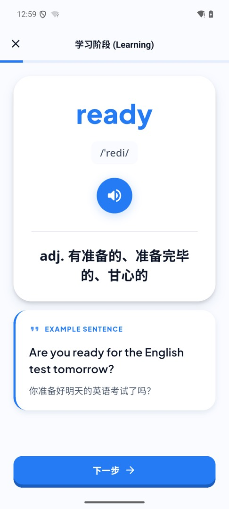
  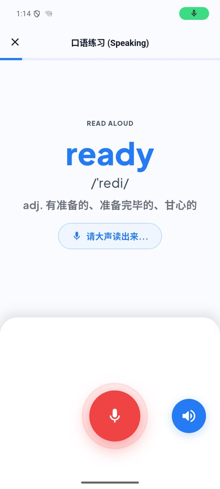
</p>

## 应用截图

<table>
  <tr>
    <td align="center" width="25%"><br/><b>学习</b><br/>每日一句、新词与复习入口</td>
    <td align="center" width="25%">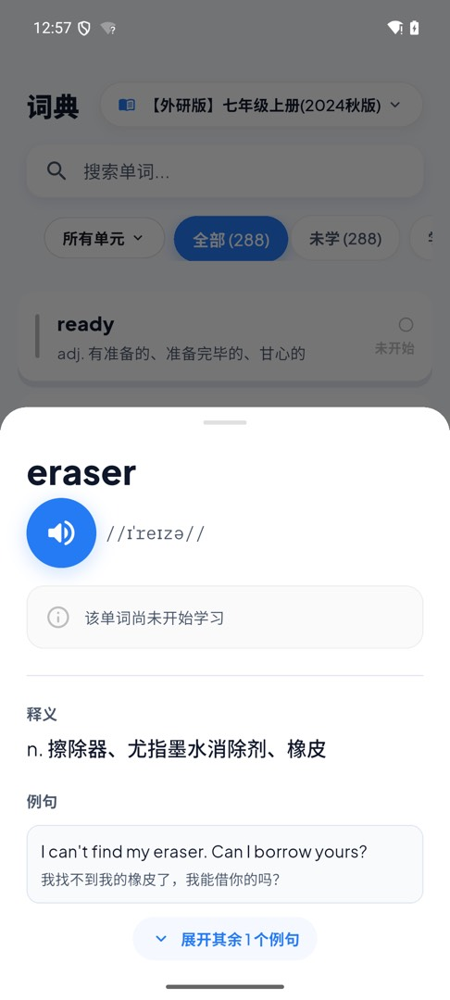<br/><b>词典</b><br/>按教材浏览，点开看音标、释义和例句</td>
    <td align="center" width="25%">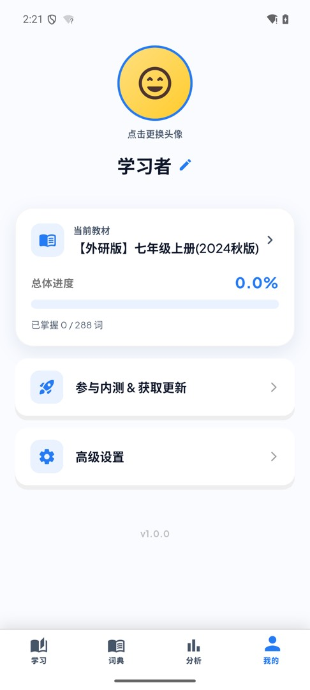<br/><b>我的</b><br/>切换教材、看进度、进入设置</td>
    <td align="center" width="25%">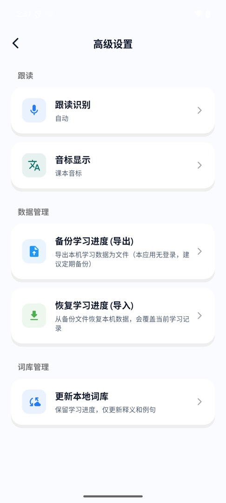<br/><b>高级设置</b><br/>跟读、备份和词库更新</td>
  </tr>
  <tr>
    <td align="center"><br/><b>学习阶段</b><br/>先听标准发音，看释义和例句</td>
    <td align="center"><br/><b>口语跟读</b><br/>跟读单词或短语，系统听写后判定</td>
    <td align="center">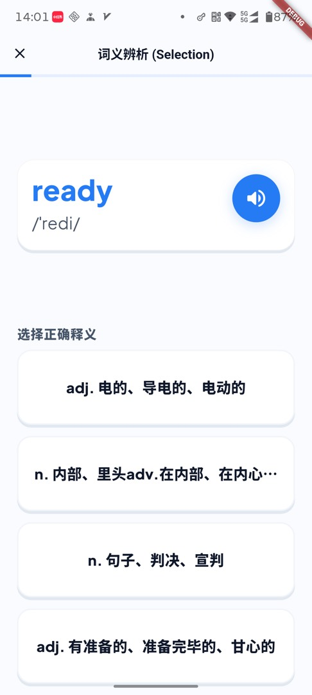<br/><b>词义辨析</b><br/>四选一，确认有没有真正看懂</td>
    <td align="center">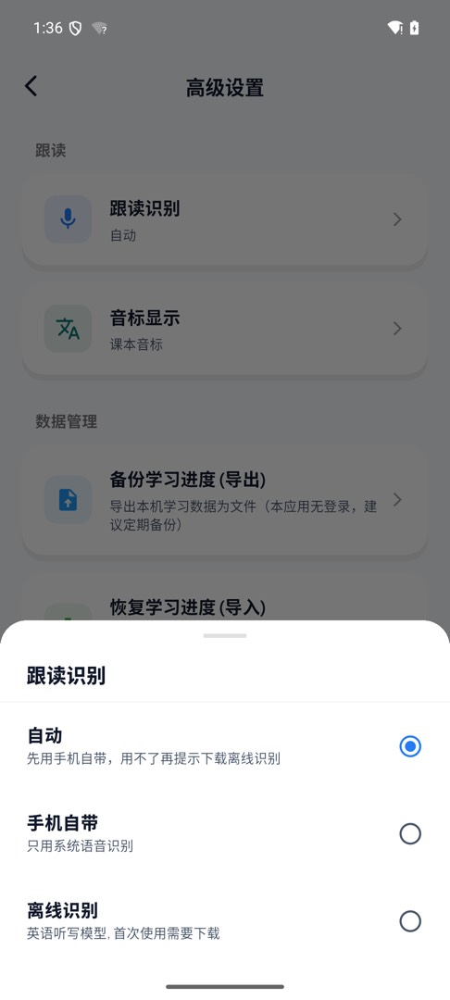<br/><b>跟读识别</b><br/>自动 / 手机自带 / 离线英语模型</td>
  </tr>
</table>

### 平板

横屏下改为左侧导航，学习和跟读会左右分栏。截自小米平板。

<table>
  <tr>
    <td align="center" width="50%">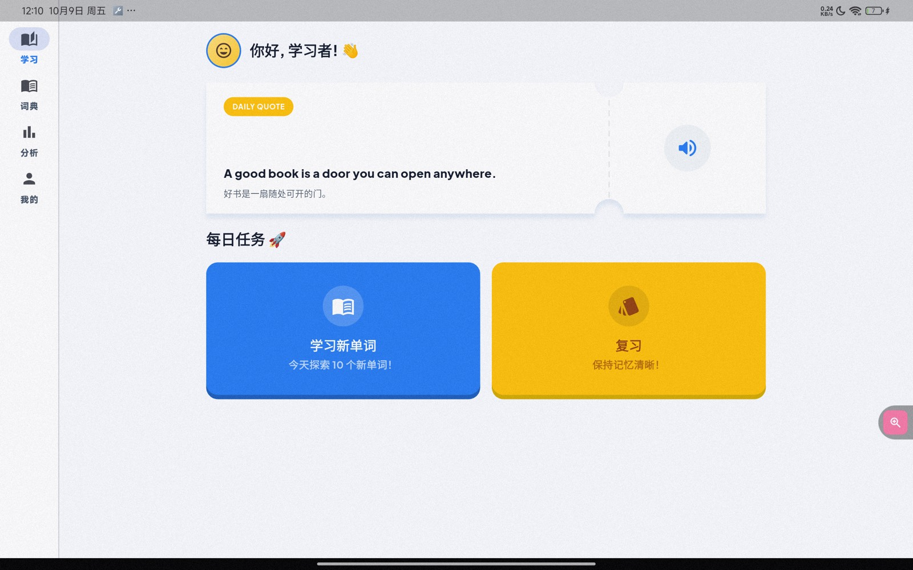<br/><b>学习</b><br/>新词和复习并排</td>
    <td align="center" width="50%">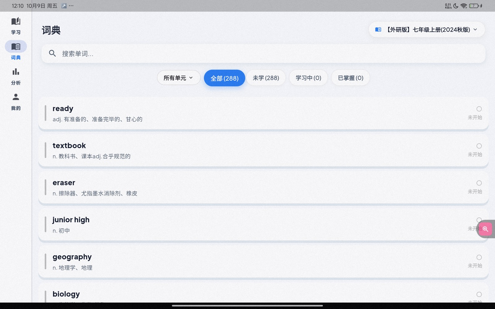<br/><b>词典</b><br/>按教材浏览词表</td>
  </tr>
  <tr>
    <td align="center">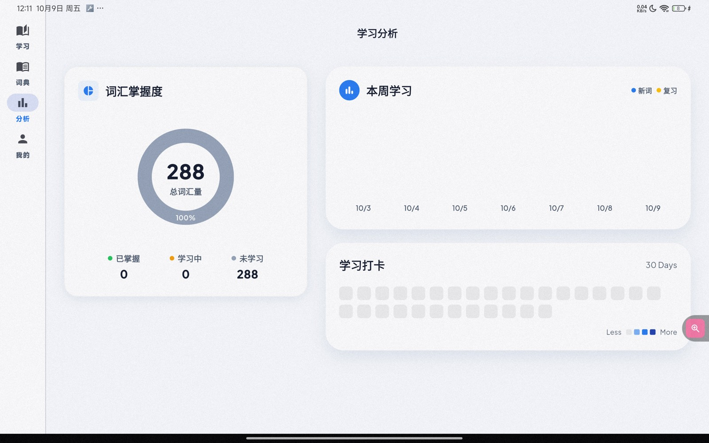<br/><b>分析</b><br/>掌握度、本周练习和打卡热力图</td>
    <td align="center">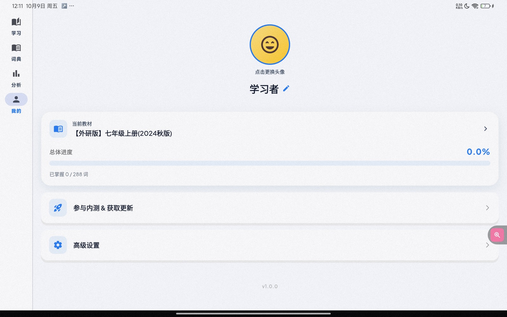<br/><b>我的</b><br/>教材、进度和设置入口</td>
  </tr>
  <tr>
    <td align="center">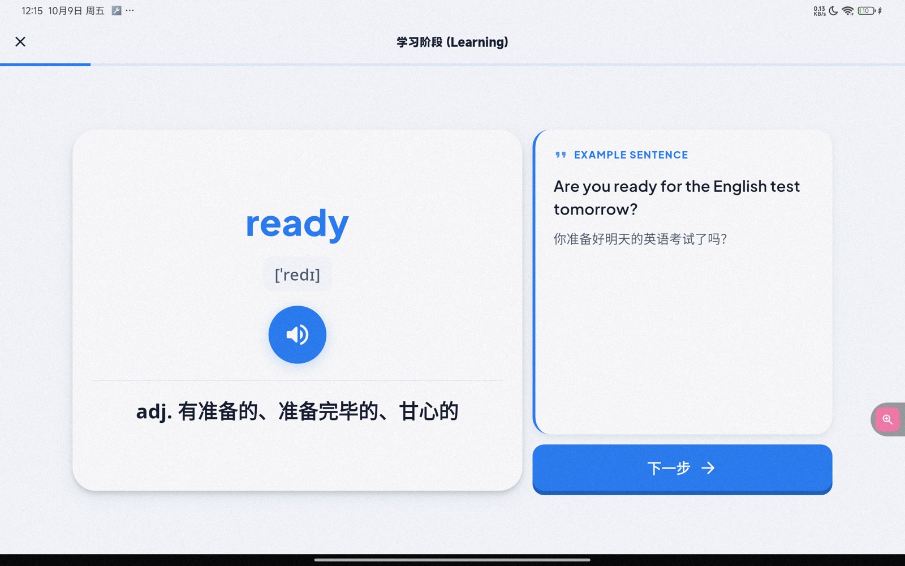<br/><b>学习阶段</b><br/>单词卡片和例句分栏</td>
    <td align="center">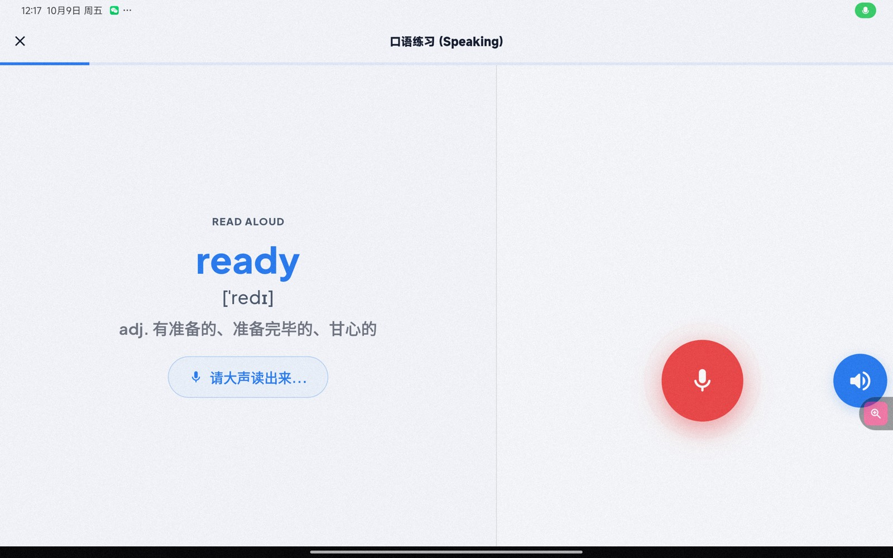<br/><b>口语跟读</b><br/>左侧读词，右侧录音</td>
  </tr>
</table>

## 核心价值

* **深度同步新教材**：词库对齐县城初中教学进度，适配 2024/2025 秋季外研社新教材。
* **听说写闭环**：每个词都要经过学习、口语、选义、拼写，而不是只翻卡片混个眼熟。
* **间隔重复**：内置 SM-2，按遗忘曲线安排复习。
* **解放家长（开发中）**：计划上线全自动同步听写，减少家长陪练负担。

## 产品特性

* **白底卡片界面**：大留白 + 高饱和蓝/黄强调色，把注意力留在单词上；平板横屏用侧栏导航和左右分栏。
* **真人发音优先**：有道 / Google Oxford 英音，失败再落到系统 TTS，并做本地缓存。
* **跟读识别可选**：优先用手机自带英语识别；国内机型也可以下载端侧 Moonshine 英语听写。没有引擎时仍可听音自练。
* **两套音标**：课本音标与词典音标都保存，默认显示课本，可在设置里切换。
* **进度可带走**：AES 加密的 `.wcc` 备份，跨设备迁移学习记录。

## 开发与运行

### 环境要求
- Flutter SDK (>= 3.10.7)
- Dart SDK

### 启动命令
```bash
flutter pub get
flutter run
```

---
*灵听单词：让新教材的每一步，都清晰入耳。*
